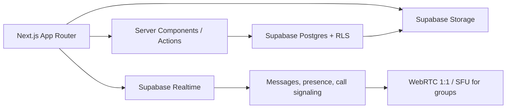

# Klecto architecture

## System shape

## Frontend

- Next.js 16 App Router, React 19, and TypeScript.
- Server-first data loading with small client islands for reactions, drawers, chat, upload progress, and realtime state.
- `@supabase/ssr` browser/server clients with cookie refresh in the Next.js proxy.
- Motion for route and overlay transitions; CSS custom properties for the design system.
- Mobile-first navigation, then a two/three-column desktop shell.

The current product surface deliberately uses a demo adapter (`src/lib/seed.ts`) so the complete interaction model can be reviewed without test accounts. Production queries should implement the same view models rather than coupling components directly to raw table rows.

## Data model

The database contains 28 RLS-protected public tables across these domains:

- identity and graph: profiles, follows, blocks;
- catalog: templates, collections, subcollections, items, media, tags;
- distribution: posts, wishlist posts, media, likes, private saves, comments;
- communication: conversations, members, messages, reactions, calls, participants;
- trust and operations: notifications, reports, share events.

Authorization helpers live in the non-exposed `private` schema. They are narrowly granted, use an empty `search_path`, and protect profile, collection, item, post, and conversation membership checks. All exposed tables have explicit Data API grants and RLS.

## Media

- `profile-media` is public for avatars/banners. Public object delivery does not require a broad Storage SELECT policy, preventing bucket listing.
- `collection-media` is private. Client uploads are restricted to the authenticated user’s top-level folder. Delivery should use short-lived signed URLs after the server verifies effective item visibility.
- Before public launch, uploads should produce responsive derivatives, strip sensitive EXIF location, compute blur placeholders, and pass media moderation.

## Realtime and chat

Messages and notifications are in the Realtime publication for the MVP. Subscription filters must always scope to the authenticated member’s conversation IDs. At larger scale, move database fan-out to private Broadcast channels and keep Presence ephemeral.

Message edit/delete state is persistent. Typing indicators, online status, and WebRTC offers/answers/ICE candidates remain ephemeral Realtime events.

## Calls

Supabase handles conversation authorization, call state, participants, and signaling. Audio/video media itself is WebRTC:

- 1:1 MVP: peer-to-peer with STUN plus a production TURN service.
- Group calls: an SFU such as LiveKit is required for reliable bandwidth and device support.
- Tokens for an SFU must be issued server-side only after `conversation_members` authorization.

## Matching

`collection_similarity(other_user)` computes an explainable first-pass score over visible item tags under the caller’s RLS context. Discovery will eventually materialize candidate scores asynchronously; the profile comparison RPC remains the source of truth for visible overlap details.

## Deployment

1. Run lint, typecheck/build, and component interaction tests.
2. Apply migrations in a preview Supabase branch.
3. Run security and performance advisors; resolve all warnings other than expected unused indexes on empty databases.
4. Run RLS tests as anon, owner, follower, stranger, blocked user, and conversation member.
5. Deploy the Next.js app with publishable variables only.
6. Smoke-test auth redirects, signed media, feed pagination, realtime reconnect, and mobile safe areas.
